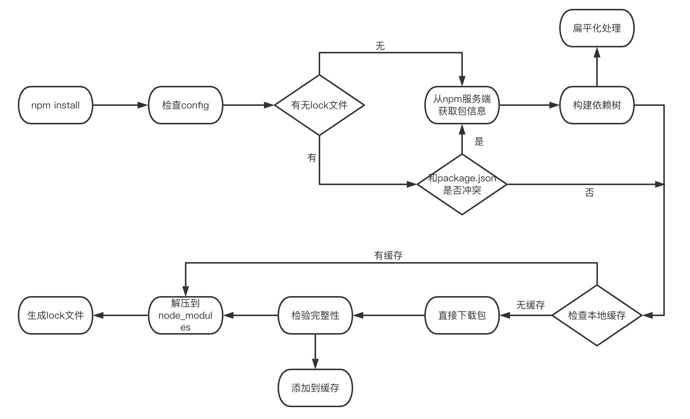

# npm 源的配置

- 命令行模式

```
npm install XXX --registry https://registry.npmmirror.com/
```

- 项目模式
  在项目更目录新建.npmrc 文件，内容

```
registry=http://8.136.210.236:4873/
```

- 用户模式
  命令行执行

```
npm config set registry https://registry.npmmirror.com
```

- 全局模式

```
npm config set registry https://registry.npmmirror.com --global
```


- scope模式
一般公司都会搭自己的npm私服，包名通过设置scope来发布，可以设置scope对应的registry
```
@对应scope:registry = 私服地址
```

优先级为：命令行 > 项目级的.npmrc 文件 > 用户级的.npmrc 文件 > Node全局.npmrc文件

> 注意：该配置的“全局”并不是当前操作系统的全局，而是当前 Node 环境，为什么强调这一点呢，这是因为多数情况我们会安装 nvm 切换多个版本的 Node, 而这里的配置项在各个版本的 Node 中是隔离的

**旧的淘宝源 2022 年 5 月 31 后停止使用，使用新的https://registry.npmmirror.com**

# npm install

## 执行过程

+ 检查 config

+ 检查项目中有无 lock 文件。

+ 无 lock 文件：

  + 从 npm 远程仓库获取包信息


  + 根据 package.json 构建依赖树，构建过程：

    + 构建依赖树时，不管其是直接依赖还是子依赖的依赖，优先将其放置在 node_modules 根目录。
    + 当遇到相同模块时，判断已放置在依赖树的模块版本是否符合新模块的版本范围，如果符合则跳过，不符合则在当前模块的 node_modules 下放置该模块。
    + 注意这一步只是确定逻辑上的依赖树，并非真正的安装，后面会根据这个依赖结构去下载或拿到缓存中的依赖包


  + 在缓存中依次查找依赖树中的每个包


    + 不存在缓存：


      + 从 npm 远程仓库下载包


      + 校验包的完整性


      + 校验不通过：

        + 重新下载

      + 校验通过：

        + 将下载的包复制到 npm 缓存目录
        + 将下载的包按照依赖结构解压到 node_modules

    + 存在缓存：将缓存按照依赖结构解压到 node_modules

  +  将包解压到 node_modules

  + 生成 lock 文件

### 检查config
这是执行npm install之后的第一个阶段，这个阶段主要做的工作是根据当前项目中 NPM 的 Config 作为启动安装的配置，在终端中输入npm config ls -l后即可查看当前的 npm config这其中包括了我们常用的 npm 包安装源、npm 包的命名空间、缓存以及缓存的行为等。

### 检查lock文件
是否存在有效的 package-lock.json 文件将会决定从npm服务端获取包信息和构建依赖树这两步工作是否要执行。

package-lock.json 文件实际上是npm 5.x 版本新增文件，它的作用是锁定依赖结构，即只要你目录下有 package-lock.json 文件，那么你每次执行 npm install 后生成的 node_modules 目录结构一定是完全相同的。

npm包 中的模块版本都需要遵循 SemVer规范, 因此我们安装依赖包的时候版本很多时候是不固定的，这就导致某些时候会由于版本的原因出现一些意料之外的报错。

但是在使用 package-lock 后，这个问题得以解决。一旦执行npm install 后, 所有依赖包的完整性信息（版本、包的下载地址、sha512 文件摘要）都将会保存在这个文件中，后续如果需要重新安装依赖，则会直接从 package-lock 文件中读取，极大的提升了安装的效率。

### 构建依赖树
所谓依赖树就是 npm 包与其依赖包之间的关系，主要体现在node_modules内部的目录结构上。这里根据 NPM 在不同时期的表现上，可以分为两种**嵌套结构** 和 **扁平结构**
#### 嵌套结构
在早期的 npm1、npm2 中呈现出的是嵌套结构，就是说了每个依赖项自己的依赖都是存放自己的 node_modules 文件夹下。
这样的方式优点很明显， node_modules 的结构和 package.json 结构一一对应，层级结构明显，并且保证了每次安装目录结构都是相同的。
但是，试想一下如果 base64-js 当中又有依赖，那么又会继续嵌套下去，这样的设计存在一些问题:

1. 依赖层级太深，会导致文件路径过长的问题，尤其在 window 系统下（文件路径最大长度为 260 个字符）。

2. 大量重复的包被安装，文件体积超级大。比如上例中的 buffer 同级目录下的ignore如果也依赖相同版本的base64-js，那么 base64-js 会分别在两者的 node_modules 中被安装，也就是重复安装。

#### 扁平模式
为了解决以上问题，NPM 在 3.x 版本做了一次较大更新。其将早期的嵌套结构改为扁平结构：

安装模块时，不管其是直接依赖还是子依赖的依赖，优先将其安装在 node_modules 根目录。

对应的，如果我们在项目代码中引用了一个模块，模块查找也进行了调整，流程如下：

+ 在当前模块路径下搜索
+ 在当前模块 node_modules 路径下搜素
+ 在上级模块的 node_modules 路径下搜索
...
+ 直到搜索到全局路径中的 node_modules

当安装到相同模块时，判断已安装的模块版本是否符合新模块的版本范围，如果符合则跳过，不符合则在当前模块的 node_modules 下安装该模块。

不难看出，扁平化仍然出现了冗余。所以 npm 3.x 版本并未完全解决老版本的模块冗余问题——甚至还会带来新的问题：

1. 依赖结构的不确定性。
2. 扁平化算法本身的复杂性很高，耗时较长。
3. 项目中可以非法访问没有声明过依赖的包

为了让开发者在安全的前提下使用最新的依赖包，我们在 package.json 通常只会锁定大版本，这意味着在某些依赖包小版本更新后，同样可能造成依赖结构的改动，依赖结构的不确定性可能会给程序带来不可预知的问题。

这就是为什么会产生依赖结构的不确定问题，也是 package-lock 文件诞生的原因——为了保证 install 之后都产生确定的node_modules结构。
### 缓存
为了加快 npm 安装的效率，在执行 npm install 或 npm update命令下载依赖后，会存放到本地的缓存目录中，然后再将对应的的依赖复制到项目的node_modules 目录下。

通过 npm config get cache 命令可以查询到：在 Linux 或 Mac 默认是用户主目录下的 .npm/_cacache 目录。

基于缓存数据，npm 提供了离线安装模式，分别有以下几种：

+ --prefer-offline： 优先使用缓存数据，如果没有匹配的缓存数据，则从远程仓库下载(默认)。
+ --prefer-online： 优先使用网络数据，如果网络数据请求失败，再去请求缓存数据，这种模式可以及时获取最新的模块。
+ --offline： 不请求网络，直接使用缓存数据，一旦缓存数据不存在，则安装失败。

### 检验文件完整性
在下载依赖包之前，我们一般就能拿到 npm 对该依赖包计算的 hash 值。
```
npm info package
```
用户下载依赖包到本地后，需要确定在下载过程中没有出现错误，所以在下载完成之后需要在本地在计算一次文件的 hash 值，如果两个 hash 值是相同的，则确保下载的依赖是完整的，如果不同，则进行重新下载。

## 四种安装方式

- npm install xxx：
  安装项目到项目目录下，不会将模块依赖写入 devDependencies 或 dependencies。

- npm install -g xxx:
  -g 的意思是将模块安装到全局，不是安装到当前目录的项目下

- npm install -save xxx:
  -save 的意思是将模块安装到项目目录下，并在 package 文件的 dependencies 节点写入依赖。

- npm install -save-dev xxx:
  -save-dev 的意思是将模块安装到项目目录下，并在 package 文件的 devDependencies 节点写入依赖。


# package.json
## version
package.json会定义项目的版本号、安装包的版本号，例如下面
```
{
  "name": "share",
  "version": "1.0.0",
  "description": "",
  "main": "index.js",
  "scripts": {
    "test": "echo \"Error: no test specified\" && exit 1"
  },
  "dependencies": {
    "package": "1.0.0"
  },
  "author": "",
  "license": "ISC"
}
```
项目发布如何修改版本号？安装包的版本号怎么引用？
### project version
1.0.0-0
主版本号(major).次版本号(minor).修订号(patch)-预发布号(release)
优先级以此递减，每次修改前面版本号都会影响后面版本号，所以谨慎操作，npm有预发布号，而yarn没有
#### 查看项目版本信息
```
npm version
或者
yarn version
```
#### 创建版本号
```
npm version <version>
或者
yarn version --new-version <version>
```

#### 升级预发布
```
npm version prerelease
```
首次执行
1.0.0 -> 1.0.0-0
再次执行
1.0.0 -> 1.0.0-1

#### 升级修订号，保留预发布号
```
npm version prepatch
```
执行结果
1.0.0-1 -> 1.0.1-0
#### 升级次版本号，保留预发布号
```
npm version preminor
```
执行结果
1.0.1-0 -> 1.1.0-0 
#### 升级主版本号，保留预发布号
```
npm version premajor
```
执行结果
1.1.0-0 -> 2.0.0-0 
#### 升级修订号
```
npm version patch
或者
yarn version --patch
``` 
首次执行
2.0.0-0 -> 2.0.0
再次执行
2.0.0 -> 2.0.1
#### 升级次版本号
```
npm version minor 
或者
yarn version --minor
```
执行结果
2.0.1 -> 2.1.0
#### 升级主版本号
```
npm version major
或者
yarn version --major
```
执行结果
2.1.0 -> 3.0.0


### package version

major.minor.patch
主版本号.次版本号.修补版本号

+ version
版本号之前不带任何标记表示必须依赖这个版本的包
例如："package": "0.0.1"

+ \>
大于某个版本，表示只要大于这个版本的安装包都行
例如："package": "> 4.0.0"

+  \>=
大于某个版本，表示只要大于或等于这个版本的安装包都行
例如："package": ">= 4.0.0"

+ <
小于某个版本，表示只要小于这个版本的安装包都行
例如："package": "<0.17.3"

+ <=
小于或等于某个版本，表示只要小于或等于这个版本的安装包都行
例如："package": "<=0.17.3"

+ ~  
大概匹配到哪个版本  
如果minor版本号指定了，那么minor最大加1，而patch如果存在大于当前值   
如果minor和patch版本号未指定，那么minor和patch版本号任意
如：~1.1.2，表示>=1.1.2 <1.2.0，可以是1.1.2，1.1.3，1.1.4，…..，1.1.n   
如：~1.1，表示>=1.1.0 <1.2.0，可以是同上  
如：~1，表示>=1.0.0 <2.0.0，可以是1.0.0，1.0.1，1.0.2，…..，1.0.n，1.1.n，1.2.n，…..，1.n.n  

+ ^  
版本号中最左边的非0数字最大加1，其余部分，大于当前值。     
如：^1.1.2 ，表示>=1.1.2 <2.0.0，可以是1.1.2，1.1.3，…..，1.1.n，1.2.n，…..，1.n.n    
如：^0.2.3 ，表示>=0.2.3 <0.3.0，可以是0.2.3，0.2.4，…..，0.2.n    
如：^0.0，表示 >=0.0.0 <0.1.0，可以是0.0.0，0.0.1，…..，0.0.n    

+ x  
x的位置表示任意版本  
如：1.2.x，表示可以1.2.0，1.2.1，…..，1.2.n  

+ \*  
任意版本，”“也表示任意版本  
如：*，表示>=0.0.0的任意版本  

+ version1 - version2   
大于等于version1，小于等于version2  
如：1.1.2 - 1.3.1，表示包括1.1.2和1.3.1以及他们件的任意版本

+ ||
满足range1或者满足range2，可以多个范围
如：<1.0.0 || >=2.3.1 <2.4.5 || >=2.5.2 < 3.0.0，表示满足这3个范围的版本都可以

## dependencies、devDependencies、peerDependencies
### dependencies
首先dependencies是大家最常用的，比如项目依赖了vue，那么vue就是dependencies，这里的依赖是会被最终构建到部署环境的。
```
// 将会保存到dependencies中
npm install package --save
// 或者不写--save也可以，默认就会到dependencies中
npm install package
// 再简单一些
npm i

// 或者用yarn
yarn add package
```

### devDependencies
与之相对的是devDependencies，他是开发过程中的依赖，比如eslint，不可能线上压缩的代码包含eslint，所以显然他应该放入devDependencies。
```
// npm
npm install package --save-dev
// 或者
npm install package -D

//yarn
yarn add package --save-dev
yarn add package -D

```

> 如果一不小心把某个生产环境的依赖写到devDependencies中，那么显然发布之后会引用不到这个依赖。

### peerDependencies
假设我们的项目使用了vuex作为状态管理器，vuex并没有dependencies，因为vuex知道你如果要使用他，就一定也会使用vue，所以他也就不会在dependencies中写入。事实上，这种情况是非常多的，尤其是对于插件而言，比如webpack，babel，eslint等等他们的插件都知道使用者一定会提供宿主自身（host）。

当然，插件仍旧是需要指明他所依赖宿主的版本号，而且他们往往对宿主环境依赖的版本号有更准确的要求。因为他们一般更可能会使用底层的api，而这些api可能在某一次minor或者patch的版本的升级中改变了。

为此，peerDependencies就派上用场了。

下面是vuex的package.json中的peerDependencies，显然他指明了自己希望的宿主vue版本号。
```
"repository": {
    "type": "git",
    "url": "git+https://github.com/vuejs/vuex.git"
  },
  "homepage": "https://github.com/vuejs/vuex#readme",
  "peerDependencies": {
    "vue": "^2.0.0"
  },
```
如果我安装了上述版本vuex之后，再安装vue3.0，就会报出一个警告：
```
yarn add vue@next
yarn add v1.22.5
[1/4] Resolving packages...
[2/4] Fetching packages...
[3/4] Linking dependencies...
warning " > vuex@3.6.0" has incorrect peer dependency "vue@^2.0.0".
[4/4] Building fresh packages...
success Saved lockfile.
success Saved 14 new dependencies.
```


# package-lock.json

## 简介
npm 5.0版本之后，npm install后都会有一个package-lock.json

## 作用
package-lock,json它会在npm更改node_modules目录树或者oackage.jsonl时自动生成的，它准确的描述了当前项目npm包的依赖树，并且在随后的安装中会根据backage-ock,json来安装，保证是相同的一个依赖树，不考虑这个过程中是否有某个依赖有小版本的更新。

它的产生就是来对整个依赖树进行版本固定的（锁死）。

当我们在一个项目中npm install时候，会自动生成一个package-lock.json文件，和package.json在同一级目录下。

package-lock.json记录了项目的一些信息和所依赖的模块。这样在每次安装都会出现相同的结果，不管你在什么机器上面或什么时候安装。

当我们下次再npm install时候，npm发现如果项目中有package-lock.json.文件，会根据backage-lock.json里的内容来处理和安装依赖而不再根据package.json。

> 1. npm安装，没有package-lock.json文件，如果npm版本是5+，会自动生成package-lock.json。有的话会默认依据该文件进行安装而不是package.json。cnpm不支持（忽略）依据package-lock.json文件安装模块，默认依赖package.json进行安装。
> 2. 需要更新版本，得去更新package.json里的模块版本，然后npm install，才能同步更新到package-lock.json

# npx

## 简介

npm从5.25.2版开始，增加了 npx 命令。方便了我在项目中使用全局包。

> npx侧重于执行命令的，执行某个模块命令。虽然会自动安装模块，但是重在执行某个命令。
> npm侧重于安装或者卸载某个模块的。重在安装，并不具备执行某个模块的功能。

Node安装后自带npm模块，可以直接使用npx命令。如果不能使用用，就要手动安装一下。
```
npm install -g npx
```
## 使用

npx想要解决的主要问题，就是调用项目内部安装的模块。比如，项目内部安装了测试工具webpack。
```
npm install webpack -D
```
如果我们使用webpack，只能在项目脚本的 package.json 中的scripts字段里面， 如果想在命令行下调用，必须像下面这样。
```
node-modules/.bin/webpack -v
```
npx 可以让项目内部安装的模块用起来更方便，只要像下面这样调用就行了。
```
npx webpack -v
```

npx 的原理很简单，就是运行的时候，会到node_modules/.bin路径和环境变量$PATH里面，检查命令是否存在。

由于 npx 会检查环境变量$PATH，所以系统命令也可以调用。
```
npx ls // 等同于ls命令
```
另外,使用npx可以避免全局安装模块，比如，create-react-app这个模块是全局安装，npx 可以运行它，而且不进行全局安装。
```
npx create-react-app my-react-app
```
上面代码运行时，npx 将create-react-app下载到一个临时目录，使用以后再删除。所以，以后再次执行上面的命令，会重新下载create-react-app。

下载全局模块时，npx 允许指定版本。
```
npx webpack@4.44.1 ./src/index.js -o ./dist/main.js
```
上面代码指定使用 4.44.1 版本的webpack进行打包操作。

注意，只要 npx 后面的模块无法在本地发现，就会下载同名模块。比如，本地没有安装webpack-dev-server模块，下面的命令会自动下载该模块，在当前目录启动一个 Webpack dev 服务。
```
npx webpack-dev-server
```
如果想让 npx 强制使用本地模块，不下载远程模块，可以使用--no-install参数。如果本地不存在该模块，就会报错。
```
npx --no-install webpack-dev-server
```
反过来，如果忽略本地的同名模块，强制安装使用远程模块，可以使用--ignore-existing参数。比如，本地已经全局安装了create-react-app，但还是想使用远程模块，就用这个参数。
```
npx --ignore-existing create-react-app my-react-app
```
利用 npx 指定某个版本的 Node 运行脚本。
```
npx node@14.10.0 -v
```
上面命令会使用 14.10.0 版本的 Node 执行脚本。原理是从 npm 下载这个版本的 node，使用后再删掉。

某些场景下，这个方法用来切换 Node 版本，要比 nvm 那样的版本管理器方便一些。

# npm run 命令

## 执行过程
1、首先会去项目的package.json文件里找scripts 里找对应的xxx，然后执行 xxx的命令，例如启动vue项目 npm run serve的时候，实际上就是执行了vue-cli-service serve 这条命令。

2、直接执行vue-cli-service serve，会报错，因为操作系统中没有存在vue-cli-service这一条指令。

3、我们在安装依赖的时候，是通过npm i xxx 来执行的，例如 npm i @vue/cli-service，npm 在 安装这个依赖的时候，就会node_modules/.bin/ 目录中创建 好vue-cli-service 为名的几个可执行文件了。

4、当使用 npm run serve 执行 vue-cli-service  serve 时，虽然没有安装 vue-cli-service的全局命令，但是 npm 会到 ./node_modules/.bin 中找到 vue-cli-service 文件作为  脚本来执行，则相当于执行了 ./node_modules/.bin/vue-cli-service serve

5、假如我们在安装包时，使用 npm install -g xxx 来安装，那么会将其中的 bin 文件加入到全局，比如 create-react-app 和 vue-cli ，在全局安装后，就可以直接使用如 vue-cli projectName 这样的命令来创建项目了。

# npm 包发布

## 创建项目

### 创建 package.json

在npm项目根目录运行终端命令，初始化生成package.json文件：
```
npm init --yes
```
package.json重点字段说明：

+ name 即npm项目包名，发布到npm时就是取的这个name名，你自己取个语义化的名字，和已有的npm库不能重复；
+ version 版本号，更新npm包时必须修改一个更高的版本号后才能成功发布到npm，版本号最好遵循npm版本管理规范；
+ description 包的描述，发布到npm后你搜索该npm包时，在搜索联想列表里会显示在包名的下方，作为描述说明；
+ main 入口文件路径，在你通过import或require引用该npm包时就是引入的该路径的文件；

### 配置npm上传白名单
配置npm上传的文件白名单，可以指定哪些文件上传哪些不上传，
比如我这里不想直接发布src里的index.js源码，而是发布dist目录下的index.min.js（index.js压缩后的文件），按以下配置：
在package.json里，修改main字段的路径指向dist/index.min.js：
```
"main": "dist/index.min.js"
```

添加files字段来配置要上传npm的文件白名单目录：
```
"files": [
  "dist"
]
```
这样dist文件夹会上传npm，而src文件夹就不会上传，想保存src源码就上传项目到git远程仓库就行，这样git仓库保存了完整项目，而npm只包含部分项目文件。

有些文件是必定会上传的，无法控制，例如package.json、LICENSE、README.md等等。
当然了，也可以配置npm上传黑名单，通过.npmignore配置，具体不再赘述。
### 关联github地址
如果想把npm包和项目github地址关联起来，首先项目需要先上传到github上，然后package.json添加repository字段：
```
"repository": {
  "type": "git",
  "url": "git://github.com/neohan666/wxmp-rsa.git"
}
```
关联并发布npm后，在npm官网的该npm包页面右边会显示有github链接，点击可以跳转到github项目地址。

## 发布

### npm注册登录
先去npm官网注册账号：https://www.npmjs.com，或者通过终端命令注册：
```
npm adduser
```
终端命令，登录npm账号：
```
npm login
```
依次输入用户名和密码登录即可，登录成功后下次就不用再登录了。

退出登录：
```
npm logout [--registry=<url>] [--scope=<@scope>]
```
### 调试npm
npm项目根目录运行终端命令：
```
npm link
```
运行后即将该npm包放进了本地npm缓存里，

如果要在其他项目里引用调试，只需要运行命令：
```
npm link 包名
```
这样就可以在本地引入这个包进行调试。

取消调试
```
npm unlink 包名
```

### 发布

在npm包项目根目录运行命令：
```
npm publish
```
运行完后，稍等片刻，在npm官网就可以搜索到发布的该npm包了。

因为很多人把npm源都切到了淘宝源，毕竟速度快，但是发布npm前需要先恢复到npm官方源上，否则发布失败，切换命令：
```
// 配置npm全局使用淘宝镜像源
npm config set registry https://registry.npm.taobao.org
// 配置npm全局恢复官方镜像源
npm config set registry https://registry.npmjs.org
```
或者呢，在项目根目录新建.npmrc文件，写入以下内容即可：
```
registry=https://registry.npmjs.org
```
这样，在此项目下运行npm命令时，默认使用的仓库都是配置官方源，不影响其他项目。

发布后的成果页面：https://www.npmjs.com/package/

如果要发布一个beta包，运行命令：
```
npm publish --tag beta
```

### 删除已发布的包
可以用deprecate作废一个包
```
npm deprecate <package-name> "<message>"
```
就是给npm包打上已作废的标签，表示不再更新维护。

删除包
```
npm unpublish package
```

注意：
npm unpublish 命令只能删除 72小时以内 发布的包
npm unpublish 删除的包，在 24小时内 不允许重复发布
https://docs.npmjs.com/policies/unpublish/


# yarn
特点
pnp

# learn
特点

# pnpm
8.1 特点
8.2 monorepo

# nx
https://dev.to/nx/nx-the-fastest-growing-monorepo-solution-in-the-js-ecosystem-5en9


参考链接：
版本信息
https://www.wenjiangs.com/doc/yarn-cli-version
https://www.cnblogs.com/cxyqts/p/15117756.html

npm 包发布
https://blog.csdn.net/u010059669/article/details/109715342