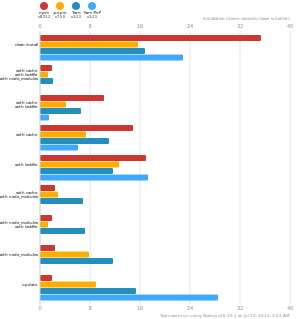

一个月前Umi 4.0.0发布，主体功能已非常稳定。

# umi4新功能

## 多构建引擎
Umi 4 同时支持 Vite 和 Webpack 两种构建方式

## 速度快
Webpack 5 物理缓存，esbuild 做 js 和 css 的压缩器、配置

## MFSU V3
热更新问题修复

## Max
Bigfish 框架的对外版本

## React Router 6

## CSR 请求
Client Loader 的目的是让应用加载默认快，避免 React 项目经典的 Render-Then-Fetch 的加载瀑布流问题。

## lint
配置了一些lint 规则，主要是可能会导致项目问题的规则

## 浏览器里的构建进度

## 支持编译结果调试

## deadCode 检测
项目中通常会有未使用的文件或导出，Umi 4 中通过配置 deadCode: {} 即可在 build 阶段做检测。如有发现，会有类似信息抛出。

##  /__umi/ 

# pnpm

pnpm 是新一代的现代化包管理工具,官网：[https://pnpm.io/](https://pnpm.io/)

## 特点
Fast, disk space efficient package manager

+ 安装速度极快
+ 磁盘空间利用高效

包安装的速度都是明显优于 npm/yarn/yarn PNP，绝大部分场景下速度甚至比他们快 2-3 倍。

## 依赖树
之前不论是 NPM 还是 YARN，都没有彻底解决规避非法访问依赖和重复安装的风险，pnpm写了全新的包管理器，开创了一套新的依赖管理机制-软链接

# 脚手架

配置

deadCode: {},

devtool: process.env.NODE_ENV === 'development' ? 'eval' : false,

inlineLimit: 0,

jsMinifierOptions: {
  minifyWhitespace: true,
  minifyIdentifiers: true,
  minifySyntax: true,
},

analyze

splitchunks

按模块打包

